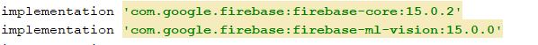
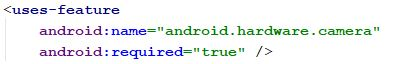
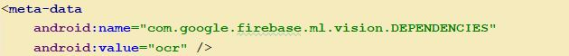
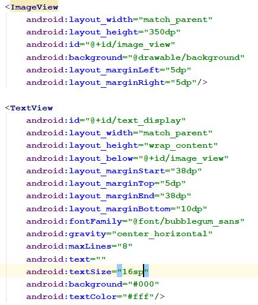
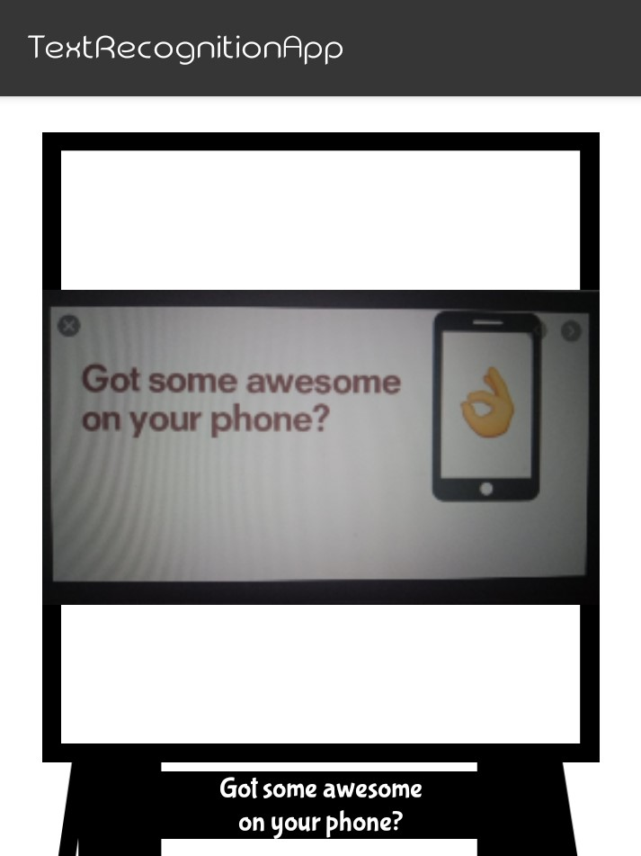
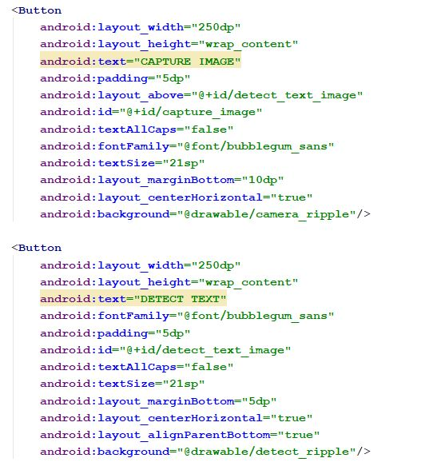
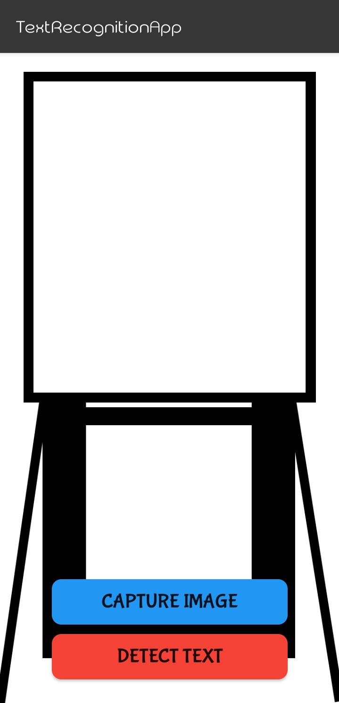
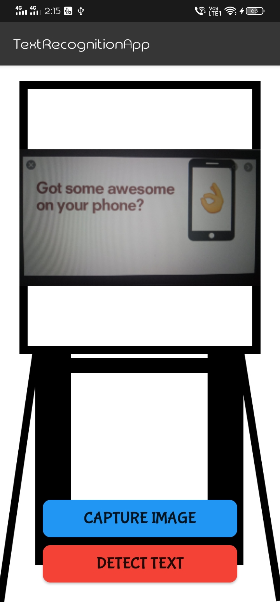
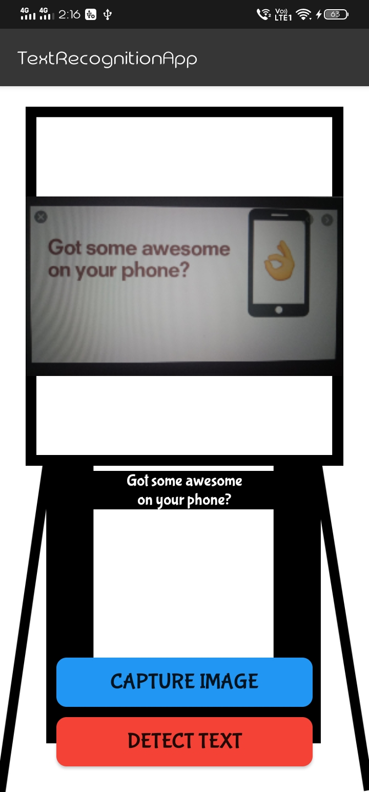

# Text-Recognition-App-Using-Firebase-MK-kit

Where text will be recognize from an image using Firebase Text Recognition kit

## Dependency

First we need to add **Firebase** dependencies in `build.gradle` app and project files

In `builde.gradle` app

here, we user old versions of ml-version and core of `firebase` because, for latest versions (above 15+) we need to use our credit card

and in `manifests` we need to put camera feature

and add `meta-data` inside `MainActivity.java` class in `application`

## Getting Started

For taking the image we need one `ImageView` and to show the text from that image we need one `TextView`

   

for capturing image and detecting the text from image we need two triggers, for that we used two `Button`s

   

# Screenshots

## Main Screen
  

## after clicked CAPTURE IMAGE button
  

## after clicked DETECT TEXT button
  

